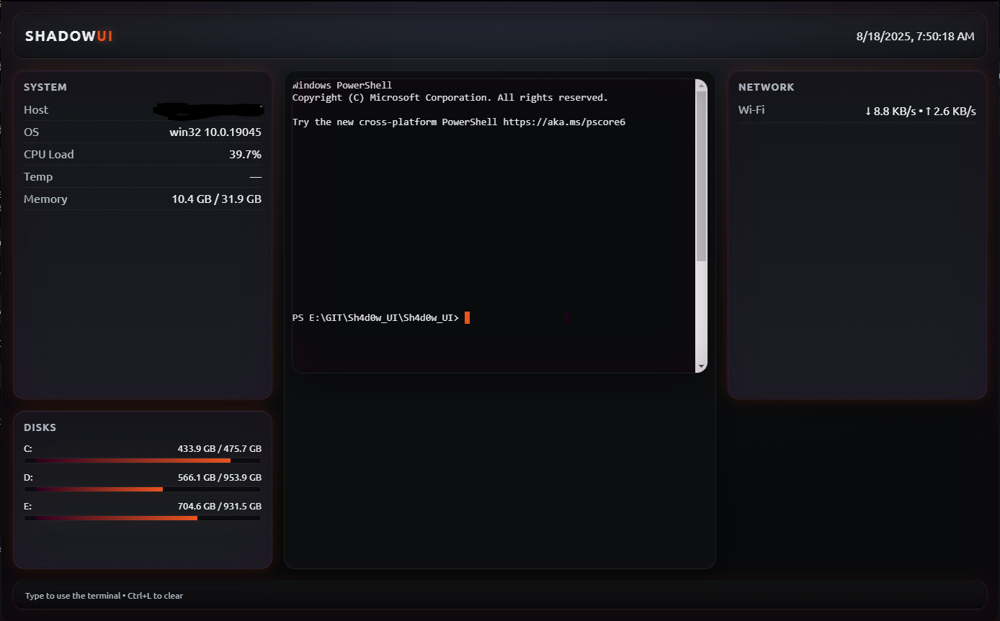

# Shadow UI (Sh4d0w_UI)

> A retro-futuristic, eDEX-UI inspired terminal dashboard for hackers and sysadmins

**Version 0.2.0 – November 2025**

Shadow UI is a cross-platform Electron-based dashboard featuring an immersive grayscale neon aesthetic with real-time system monitoring capabilities and fully interactive terminal. Designed for power users who appreciate both form and function in their development environment.


## 🌟 Features

- **xterm.js Powered Terminal**: Fully interactive shell with support for bash, zsh, and PowerShell backends, complete with ANSI color support and Unicode compatibility.
  - **Session Persistence**: Automatically saves and restores working directory, shell, and terminal size across restarts
  - **Enhanced Security**: Terminal escape sequence filtering to prevent attacks

- **Live System Monitoring**:
  - CPU load and per-core usage visualization with unicode progress bars
  - Memory consumption metrics with detailed allocation tracking
  - Network throughput (up/down) with interface-specific statistics
  - Disk usage visualizations with mount point detection
  - Temperature monitoring with threshold alerts (when sensors available)
  - Battery status tracking with discharge rate (on portable devices)
  - **IPC Rate Limiting**: Protection against DoS attacks

- **Interactive Interface Components**:
  - Live clock and date widget that respects system locale
  - Host and OS information display
  - Responsive layout that adapts to window size changes

- **Adaptive Theme Engine**:
  - Modern grayscale aesthetic with high-contrast option
  - Alternative "Paranoid Ubuntu" theme included
  - Custom CSS theming support

- **Cross-Platform Consistency**:
  - Identical experience across Windows, macOS, and Linux
  - Native system shell detection and integration

- **Security Hardened**:
  - Content Security Policy (CSP) with Subresource Integrity (SRI)
  - Debug commands restricted to development mode
  - Environment variable sanitization
  - Input validation and rate limiting

- **Developer Experience**:
  - TypeScript support with strict type checking
  - Comprehensive test suite (58 tests)
  - ESLint and Prettier for code quality
  - Automated testing with Jest

## 📋 Prerequisites

- **Node.js**: Version 18 LTS or higher (v20+ recommended)
- **npm**: Latest version
- **Operating System**: Windows 10+, macOS 10.14+, or Linux (any modern distribution)

## 🚀 Quick Start

### Installation
```bash
cd Sh4d0w_UI
npm install
```

### Development
```bash
npm start
```

### Building for Production
```bash
# Build for current platform
npm run pack

# Build distributable
npm run dist
```

## 🔧 Project Structure

```
Sh4d0w_UI/
├── main.js              # Main Electron process
├── preload.js           # Preload script for security
├── package.json         # Project configuration
├── renderer/
│   ├── index.html       # Main UI
│   ├── renderer.js      # UI logic and system monitoring
│   ├── styles.css       # Main styles
│   └── styles-paranoid-ubuntu.css  # Alternative theme
└── README.md           # This file
```

## 💻 Technology Stack

| Technology | Version | Purpose |
|------------|---------|--------|
| [Electron](https://electronjs.org/) | 38.1.2 | Cross-platform desktop framework |
| [Node.js](https://nodejs.org/) | ≥18 | JavaScript runtime environment |
| [TypeScript](https://www.typescriptlang.org/) | 5.9.3 | Type-safe development |
| [@homebridge/node-pty-prebuilt-multiarch](https://www.npmjs.com/package/@homebridge/node-pty-prebuilt-multiarch) | 0.12.0 | Terminal emulation with cross-platform support |
| [electron-store](https://www.npmjs.com/package/electron-store) | 8.2.0 | Data persistence between sessions |
| [systeminformation](https://www.npmjs.com/package/systeminformation) | 5.25.11 | Hardware and system monitoring |
| [electron-builder](https://www.npmjs.com/package/electron-builder) | 26.0.12 | Application packaging and distribution |
| [Jest](https://jestjs.io/) | 30.2.0 | Testing framework |
| [ESLint](https://eslint.org/) | 9.39.1 | Code linting |

## System Requirements

### Windows
- Windows 10 or later
- Visual C++ Redistributable (usually included)

### macOS
- macOS 10.14 or later
- Xcode Command Line Tools (if building from source)

### Linux
- Ubuntu 18.04+ / Debian 10+ / CentOS 8+ or equivalent
- Build essentials: `sudo apt install build-essential`
- Python 3 for native modules

## Troubleshooting

### Fresh Installation (Windows)
If you encounter issues with prebuilt binaries:

```powershell
# Clean install
rmdir /s /q node_modules 2>$null
del package-lock.json yarn.lock pnpm-lock.yaml 2>$null
npm install
npm start
```

### Common Issues

1. **Node-pty build errors**: Ensure you have Node.js 20 LTS installed
2. **Font rendering issues**: Adjust `fontSize` and container sizing in `renderer.js`
3. **Permission errors**: Run with appropriate permissions for system monitoring

## Configuration

The application uses `electron-store` for persistent configuration. Settings are automatically saved and restored between sessions.

## Contributing

1. Fork the repository
2. Create a feature branch: `git checkout -b feature-name`
3. Make your changes
4. Commit your changes: `git commit -am 'Add some feature'`
5. Push to the branch: `git push origin feature-name`
6. Submit a pull request

## License

This project is licensed under the GNU General Public License v3.0 - see the [LICENSE](LICENSE) file for details.

## Acknowledgments

- Inspired by [eDEX-UI](https://github.com/GitSquared/edex-ui)
- Built with [Electron](https://electronjs.org/)
- Terminal integration via [@homebridge/node-pty-prebuilt-multiarch](https://www.npmjs.com/package/@homebridge/node-pty-prebuilt-multiarch)

## 📷 Screenshots

### Shadow UI Dashboard

*Complete Shadow UI interface showing terminal integration and real-time system monitoring*

**Additional screenshots:**
- More screenshots coming soon to showcase specific features
- Alternative theme demonstrations
- Detailed monitoring views

## 📚 Version History

- **v0.2.0** (November 2025):
  - **Security Hardening**: CSP with SRI, debug command restrictions, environment sanitization, IPC rate limiting
  - **Terminal Session Persistence**: Automatic save/restore of working directory and shell configuration
  - **Enhanced Terminal Sanitization**: Filters dangerous escape sequences (OSC, DCS, PM, APC)
  - **TypeScript Support**: Added type safety and strict type checking
  - **Comprehensive Testing**: 58 tests covering security, validation, and functionality
  - **Code Quality**: ESLint and Prettier integration
  - **Updated Dependencies**: Electron 38.1.2, electron-builder 26.0.12
  - Project renamed from lite_win_ui to Sh4d0w_UI
  - Major UI redesign with improved grayscale theme
  - Enhanced system monitoring with more detailed metrics
  - Added alternative "Paranoid Ubuntu" theme

- **v0.1.3** (Previous release):
  - Basic system monitoring implementation
  - Initial terminal integration

---

**Shadow UI** - A modern take on retro-futuristic terminal interfaces.
